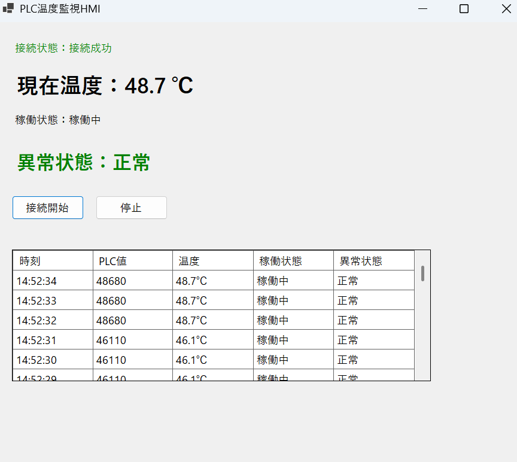
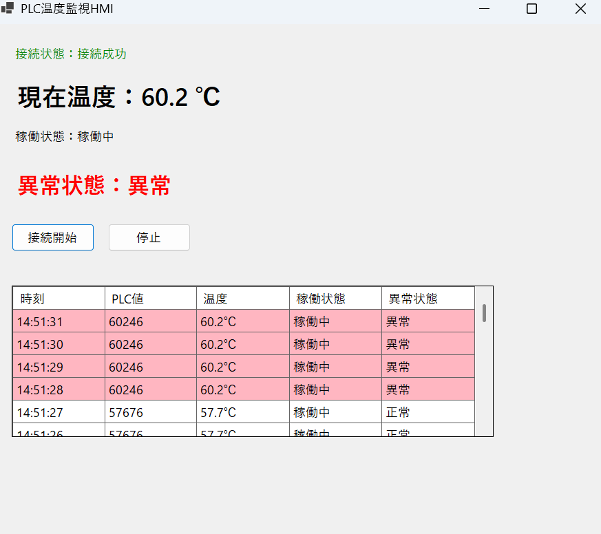

# Manufacturing DX / AI Monitoring System

製造業向け設備監視・AI/DXを想定したポートフォリオプロジェクトです。

本プロジェクトでは、

* PLC通信
* 設備監視
* HMI表示
* 異常検知
* CSVログ管理
* Web可視化
* AI/DX構想

をテーマとして、
C# / Modbus TCP / Next.js を組み合わせたシステム開発を行っています。

---

# Project Overview

設備保全経験とC#開発経験を活かし、
製造業の現場監視を想定したシステムを作成しました。

単なるWeb制作ではなく、

* 現場データ取得
* PLC通信
* 設備状態監視
* AI連携を想定した構成
* 将来的なIoT/DX拡張

まで考慮して設計しています。

---

# Manufacturing DX Concept

```text
PLC
↓
Modbus TCP
↓
C# Monitoring System
↓
FastAPI
↓
AI Inference
↓
Visualization / Alert
```

製造業では、
AIモデルそのものだけではなく、

* 現場データ取得
* 設備通信
* 運用保守
* 可視化
* 異常検知

まで含めた設計が重要になります。

---

# Corporate Site

製造業向けAI/DX企業を想定した
Next.js製コーポレートサイトも実装しています。

## 使用技術

* Next.js 15
* TypeScript
* Tailwind CSS
* Framer Motion
* React Hook Form
* Zod

## 実装内容

* ダークUI
* レスポンシブ対応
* 問い合わせフォーム
* FastAPI連携想定
* AI/DX向けデザイン
* 製造業向けサービス構成

---

# Future Vision

今後は以下の機能追加を予定しています。

* MQTT連携
* ONNX Runtime
* AI異常検知
* Azure連携
* Docker対応
* リアルタイムグラフ表示
* IoTダッシュボード化


# PLC温度監視システム

## 1. システム概要

本システムは、C#とHslCommunicationを使用してPLCのレジスタ値を定周期で取得し、
設備温度監視・異常検知・CSVログ保存を行う簡易設備監視システムです。

Modbus TCP通信を用いてPLC相当データを取得し、
設備の稼働状態や温度異常を監視することを目的としています。

PLC実機の代わりにModRSsim2を使用して動作確認を行っています。

設備保全経験とC#開発経験を活かし、
PLC設備監視を想定した簡易HMIシステムを作成しました。

Modbus TCP通信によるデータ取得、
HMI表示、
異常検知、
ログ保存機能を実装しています。

---

## 2. 使用技術

- C#
- .NET 10
- Modbus TCP（自前実装 / HslCommunication 非依存）
- ScottPlot.WinForms 5.1.58（リアルタイムグラフ）
- VS Code
- ModRSsim2

---

## 3. 実装機能

### PLC通信
- Modbus TCP通信によるPLCレジスタ値取得

### 温度監視
- PLC値を温度データとしてスケーリング変換
- 温度監視処理

### 稼働状態監視
- PLC値から設備の稼働/停止状態を判定

### 異常検知
- 温度閾値超過時に異常判定
- コンソール上で異常メッセージを赤文字表示

### リアルタイム温度グラフ（Version 2）
- ScottPlot.WinFormsによる温度推移グラフ表示
- 直近10分（最大600点）の温度履歴を可視化
- 60℃アラーム閾値ラインをグラフ上に常時表示
- ダークテーマUI（左側ステータス＋右側チャートの2ペイン構成）

### アラーム履歴管理（Version 3）
- 60℃超過で自動検知、復旧時にアラーム履歴を記録
- 発生時刻・復旧時刻・継続時間・最大温度を保持（最大100件）
- アラーム履歴をDataGridViewでリアルタイム表示
- AlarmHistory.csvへ自動保存（UTF-8 BOM付き、追記モード）
- AlarmHistoryクラスによるデータモデル分離

### 設備診断サマリ（Version 4 Phase 4a）
- 通信断検知：5回連続失敗で「通信断」表示、段階的に色変化（正常→不安定→通信断）
- 稼働率表示：接続セッション内の稼働サンプル/総サンプル比をリアルタイム計算
- 平均温度：直近600点（最大10分）の移動平均温度を表示
- 最大温度：セッション開始からの最大到達温度を記録・表示
- 本日アラーム回数：当日発生したアラーム件数をLINQで集計
- DiagnosticsStatsクラス（initプロパティ）による診断データのイミュータブル設計
- チャートとアラーム履歴の間に診断パネルを配置（2ペイン→3セクション構成）

### ログ保存
- CSV形式で監視ログを保存
- 日付ごとのログファイル生成

### 通信監視
- PLC通信失敗時のエラーログ出力
- 例外発生時のログ記録

---

## 4. 動作イメージ

```text
PLC温度監視アプリを起動します。
接続先: 127.0.0.1:502
接続成功

[2026/05/26 11:44:09]
PLC値:59054 温度:59.1℃ 稼働中 正常

[2026/05/26 11:44:12]
PLC値:61624 温度:61.6℃ 稼働中 異常

温度異常発生！
```

---

## 5. 実行方法

### NuGetパッケージインストール

```bash
dotnet add package HslCommunication
```

### 実行

```bash
dotnet run
```

### 使用シミュレーター

- ModRSsim2

### 接続設定

```csharp
const string IpAddress = "127.0.0.1";
const int Port = 502;
```

---

## 6. ログ出力

監視ログはCSV形式で保存されます。

### 出力先

```text
bin/Debug/net8.0/Logs/
```

### 出力例

```csv
時刻,PLC値,温度,稼働状態,異常状態,通信状態
2026/05/26 11:44:09,59054,59.1,稼働中,正常,正常
2026/05/26 11:44:12,61624,61.6,稼働中,異常,正常
```

---

## 7. 今後の改善

- WPF版への拡張
- ~~リアルタイムグラフ表示~~ ✅ Version 2 で実装済み
- ~~アラーム履歴管理~~ ✅ Version 3 で実装済み
- ~~設備診断サマリ（通信断/稼働率/平均温度/最大温度/本日アラーム）~~ ✅ Version 4 Phase 4a で実装済み
- PLC書込み機能追加
- MQTT/REST API連携
- データベース保存対応
- Docker対応
- クラウド連携

---

## システム構成

```text
C#アプリ
↓
HslCommunication
↓
Modbus TCP通信
↓
ModRSsim2（PLCシミュレーター）
```

## 工夫した点

- Modbus TCP通信によるPLCデータ監視を実装
- WinFormsを用いた簡易HMI画面を作成
- 異常状態を色分け表示
- DataGridViewでリアルタイムログ監視を実装
- 温度閾値による異常検知を追加
- 通信失敗時の状態表示を実装
- ScottPlotによるリアルタイム温度グラフを追加（Version 2）
- 直近10分の温度トレンドをCornflowerBlueの折れ線で可視化
- 60℃アラーム閾値ラインをOrangeRedの破線で常時表示
- 60℃超過のアラーム履歴を自動記録・表示・CSV保存（Version 3）
- AlarmHistoryクラスで発生時刻・復旧時刻・継続時間・最大温度を管理
- 設備診断サマリパネルを追加（Version 4 Phase 4a）
- DiagnosticsStatsクラス（initプロパティ）で診断値をイミュータブルに保持
- 連続通信失敗5回で「通信断」を検知し段階的に色変化で視覚化
- 接続セッション単位の稼働率・最大温度をリアルタイム集計

## 想定課題

- 設備温度異常の見逃し
- 稼働状態の可視化不足
- ログ管理の属人化

## 解決内容

- 温度閾値監視による異常検知
- HMIによる状態可視化
- CSVログ自動保存

## HMI画面（正常時）



## HMI画面（異常時）

