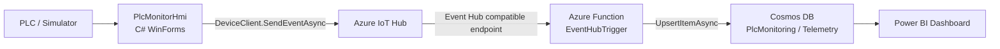
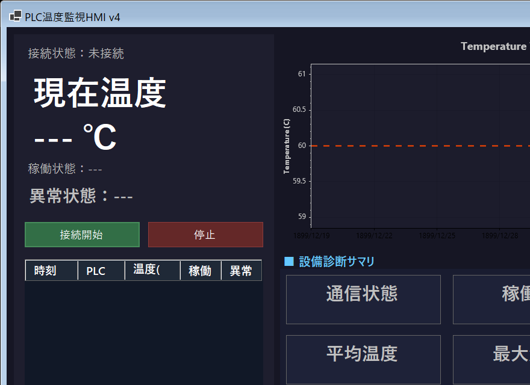
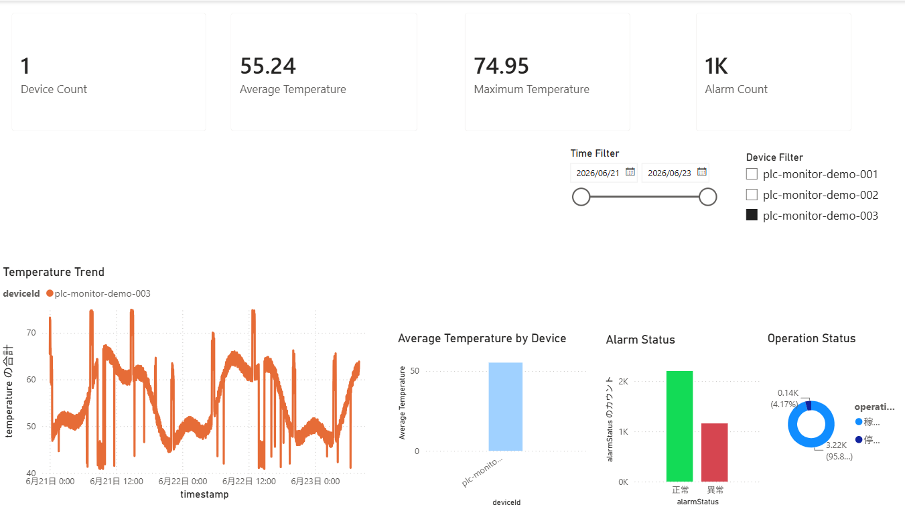

# 製造業向け IoT 監視システム

PLC/HMI の設備テレメトリを Azure IoT Hub に送信し、Azure Function で処理して Cosmos DB に保存する製造業向け IoT/DX ポートフォリオです。次の段階として、Cosmos DB のデータを Power BI で可視化します。

```text
PLC/HMI -> Azure IoT Hub -> Azure Function -> Cosmos DB -> Power BI
```

## 概要

このリポジトリは、製造現場の設備監視を想定した end-to-end の実装です。

- C# WinForms HMI で温度、稼働状態、異常状態を表示
- HMI から Azure IoT Hub へ telemetry を送信
- IoT Hub の Event Hub compatible endpoint を Azure Function で購読
- Azure Function から Cosmos DB に telemetry document を保存
- Power BI で設備監視ダッシュボードを構築予定

## 解決したい課題

製造現場では、設備データが PLC/HMI やローカルログに閉じてしまい、異常傾向や稼働状態を横断的に分析しにくいことがあります。このプロジェクトでは、現場データをクラウドに蓄積し、保全・改善・可視化につなげる構成を実装しています。

## システム構成



## データフロー

1. `PlcMonitorHmi` が PLC またはデモデータから telemetry を生成します。
2. HMI が `AZURE_IOT_HUB_DEVICE_CONNECTION_STRING` を使って Azure IoT Hub に送信します。
3. `PlcTelemetryFunction` が IoT Hub の Event Hub compatible endpoint を購読します。
4. Function が `EventData.EventBody` から JSON 本文を取得します。
5. JSON を `TelemetryPayload` に変換します。
6. `CosmosTelemetryDocument` を作成します。
7. Cosmos DB container `Telemetry` に `/deviceId` partition key で保存します。
8. Power BI で温度推移、異常件数、設備別指標を可視化します。

## 使用技術

- C#
- .NET / WinForms
- Azure IoT Hub
- Azure Functions isolated worker
- Azure Cosmos DB for NoSQL
- Azure CLI
- Power BI
- Newtonsoft.Json
- System.Text.Json

## リポジトリ構成

```text
PlcMonitorApp/
  PlcMonitorHmi/              # HMI and IoT Hub telemetry sender
  PlcTelemetryFunction/       # EventHubTrigger and Cosmos DB writer
  docs/
    architecture.md
    troubleshooting.md
    powerbi-plan.md
    powerbi-setup.md
    powerbi-checklist.md
    images/
  README.md
```

## Azure リソース

| Resource | Role |
|---|---|
| Azure IoT Hub | HMI からの device-to-cloud telemetry を受信 |
| Event Hub compatible endpoint | Azure Function が購読する組み込み endpoint |
| Consumer Group `function` | Function 専用の読み取り位置 |
| Azure Function App | telemetry を受信して Cosmos DB に保存 |
| Cosmos DB Database `PlcMonitoring` | telemetry 保存用 database |
| Cosmos DB Container `Telemetry` | telemetry document 保存先 |
| Partition Key `/deviceId` | device 単位の partitioning |
| Power BI | 監視・分析ダッシュボード |

## Cosmos DB 保存データ例

```json
{
  "id": "plc-monitor-demo-001-202606271543568240050-...",
  "deviceId": "plc-monitor-demo-001",
  "timestamp": "2026-06-28T00:43:56.824005+09:00",
  "connectionStatus": "Demo",
  "rawValue": 63241,
  "temperature": 63.24,
  "operationStatus": "稼働中",
  "alarmStatus": "異常",
  "errorMessage": null,
  "ingestedAt": "2026-06-27T15:43:57.8996079+00:00"
}
```

## 実装済み機能

- HMI 画面での温度・状態表示
- PLC 未接続時のデモ telemetry 生成
- ローカル JSONL ログ出力
- Azure IoT Hub への telemetry 送信
- `az iot hub monitor-events` による受信確認
- Azure Function `EventHubTrigger` による IoT Hub 受信
- Consumer Group `function` 対応
- Cosmos DB への telemetry 保存
- Cosmos DB partition key `/deviceId` 対応
- Cosmos DB BadRequest 400 の原因調査と修正
- Power BI ダッシュボード設計書作成

## PLC Temperature Monitoring HMI

WinForms / C# で実装したPLC温度監視用HMIです。  
PLC値、温度、稼働状態、異常状態を監視し、設備診断サマリとアラーム履歴を表示します。



### HMI Features

- Real-time temperature monitoring
- PLC raw value display
- Operation status display
- Alarm status display
- Temperature trend chart
- Equipment diagnostic summary
- Alarm history table
- Dark industrial HMI style
- Responsive layout adjustment

## Power BI Dashboard

Power BI Desktop で Cosmos DB telemetry / CSV demo data を読み込み、製造業向け IoT 設備監視ダッシュボードを作成しました。



### Dashboard Features

- Device Count KPI
- Average Temperature KPI
- Maximum Temperature KPI
- Alarm Count KPI
- Temperature Trend by device
- Average Temperature by Device
- Alarm Status analysis
- Operation Status analysis
- Device filter
- Time range filter

### Analytics Flow

```text
PLC/HMI
↓
Azure IoT Hub
↓
Azure Functions
↓
Cosmos DB
↓
CSV Export
↓
Power BI Dashboard
```

## Portfolio Screenshots

Power BI 完成後、以下の順番で画像を追加します。

```markdown


```

## トラブルシュート要点

- HMI が送信しない場合は `AZURE_IOT_HUB_DEVICE_CONNECTION_STRING` の設定を確認します。
- Function が起動しない場合は `IOTHUB_EVENTHUB_CONNECTION`、`IOTHUB_EVENT_HUB_NAME`、`IOTHUB_CONSUMER_GROUP` を確認します。
- `IOTHUB_EVENTHUB_CONNECTION` は `Endpoint=sb://...` 形式の Event Hub compatible connection string が必要です。
- Cosmos DB 400 が出る場合は container partition key が `/deviceId` か確認します。
- Cosmos DB SDK では `id` と `deviceId` の JSON property name が重要です。
- このプロジェクトでは `Newtonsoft.Json.JsonProperty` を使って Cosmos DB に `id` / `deviceId` として保存します。

## 学んだこと

- IoT Hub device connection string と Event Hub compatible connection string は用途が異なります。
- Azure Function には専用 consumer group を使うと監視と処理を分離できます。
- Cosmos DB の partition key path と JSON property name は完全に一致させる必要があります。
- HMI、IoT Hub、Function、Cosmos DB、Power BI をつなぐことで、現場データを分析資産にできます。

## ドキュメント

- [Architecture](docs/architecture.md)
- [Troubleshooting](docs/troubleshooting.md)
- [Power BI Plan](docs/powerbi-plan.md)
- [Power BI Setup Guide](docs/powerbi-setup.md)
- [Power BI Build Checklist](docs/powerbi-checklist.md)
- [IoT Hub Verification](docs/azure-iot-hub-verification.md)
- [Azure Function + Cosmos DB Phase Notes](docs/phase2-azure-function-cosmos.md)

## Cosmos DB CSV Export

`Tools/CosmosExportTool` exports the latest 1000 telemetry documents from Cosmos DB to a CSV file for Power BI import.

Source:

```text
Database: PlcMonitoring
Container: Telemetry
```

Output:

```text
exports/telemetry.csv
```

The tool reads the Cosmos DB connection string from environment variables. Do not write real keys or connection strings into source files.

Required:

```powershell
$env:COSMOS_DB_CONNECTION_STRING = "<cosmos-db-connection-string>"
```

Optional:

```powershell
$env:COSMOS_DB_DATABASE_NAME = "PlcMonitoring"
$env:COSMOS_DB_CONTAINER_NAME = "Telemetry"
```

Run from the repository root:

```powershell
dotnet run --project .\Tools\CosmosExportTool\CosmosExportTool.csproj
```

The CSV contains:

```text
timestamp,deviceId,temperature,operationStatus,alarmStatus,connectionStatus,rawValue,ingestedAt
```

## Power BI Import From CSV

Use this path when direct Cosmos DB connection is not needed or when sharing a portable demo dataset.

1. Open Power BI Desktop.
2. Select `Home`.
3. Select `Get data`.
4. Select `Text/CSV`.
5. Choose `exports/telemetry.csv`.
6. Select `Transform Data`.
7. Set column types:
   - `timestamp`: Date/Time
   - `deviceId`: Text
   - `temperature`: Decimal Number
   - `operationStatus`: Text
   - `alarmStatus`: Text
   - `connectionStatus`: Text
   - `rawValue`: Whole Number
   - `ingestedAt`: Date/Time
8. Select `Close & Apply`.

Recommended Power BI pages:

- Temperature trend: line chart with `timestamp` on X-axis and `temperature` on Y-axis.
- Alarm analysis: count by `alarmStatus`, abnormal event table, daily/hourly abnormal trend.
- Device analysis: count, average temperature, maximum temperature, and alarm rate by `deviceId`.

## Power BI Demo Data

Power BI dashboard screenshots can look sparse when Cosmos DB only has a small number of telemetry rows. For portfolio demos, this repository includes a generated CSV dataset:

```text
exports/demo-telemetry.csv
```

Dataset summary:

- 10,080 telemetry rows
- 3 devices:
  - `plc-monitor-demo-001`
  - `plc-monitor-demo-002`
  - `plc-monitor-demo-003`
- 1-minute interval timestamps
- Temperature range: 40 to 75 C
- `alarmStatus = 異常` when `temperature >= 60`
- Natural-looking temperature changes, abnormal spikes, and short stop periods

Use this file in Power BI Desktop:

1. Select `Home`.
2. Select `Get data`.
3. Select `Text/CSV`.
4. Choose `exports/demo-telemetry.csv`.
5. Select `Transform Data`.
6. Apply the same type conversions as the production CSV.
7. Build the temperature trend, alarm analysis, and device analysis pages.
